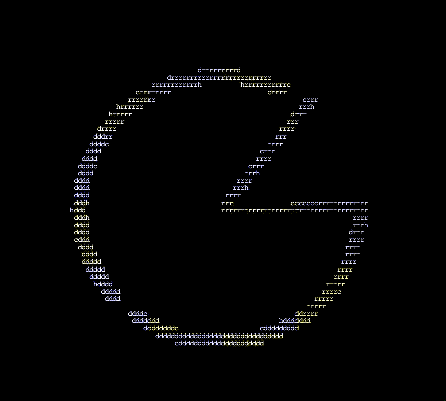

# cheddr ascii logo

Install Node.js. We'll need it to load manage dependencies and to run our build tool.
Install three.js and a build tool, Vite, using a terminal in your project folder. Vite will be used during development, but it isn't part of the final webpage. If you prefer to use another build tool, that's fine — we support modern build tools that can import ES Modules.

# three.js

`npm install --save three`

# vite

`npm install --save-dev vite`

Installation added node_modules/ and package.json to my project. What are they?
From your terminal, run:

`npx vite`
If everything went well, you'll see a URL like http://localhost:5173 appear in your terminal, and can open that URL to see your web application.

